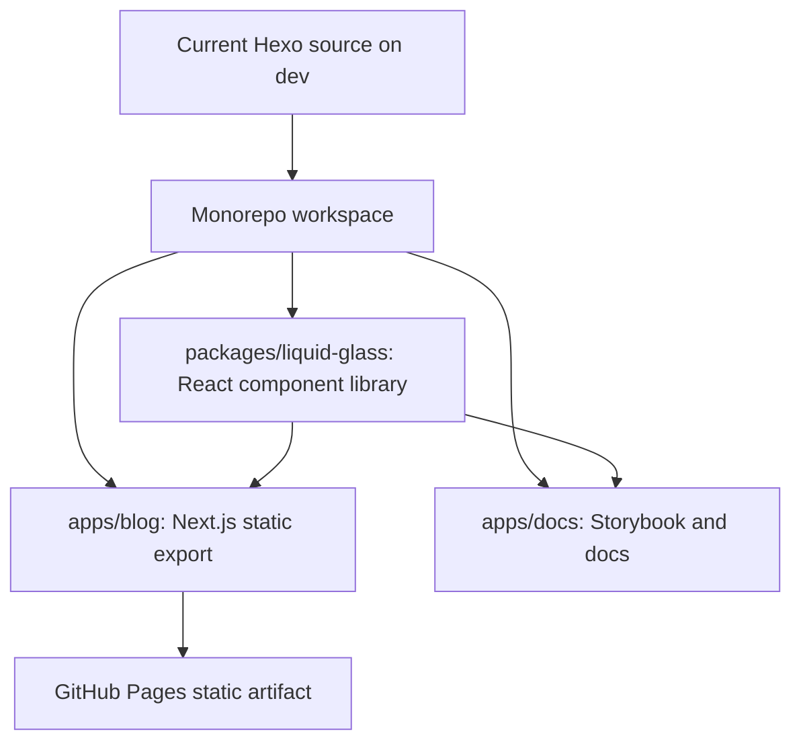
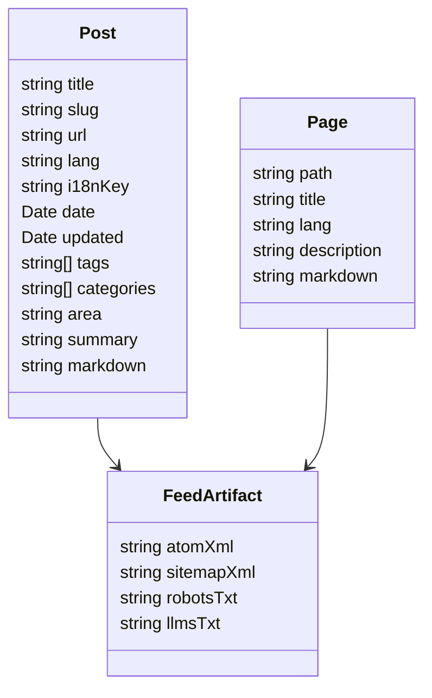

# ADR 0001: Liquid Glass Next.js Monorepo

Date: 2026-06-11

Status: Superseded by [ADR 0005](0005-astro-static-rebuild.md)

## Context

The current source branch is `dev`. The checked-out `master` branch is the generated GitHub Pages output branch, not the source branch. The source project is currently a Hexo site with EJS templates and global CSS:

- `package.json` defines Hexo build and deploy scripts.
- `_config.yml` sets `theme: minima`, `permalink: :year/:month/:day/:title/`, `language: [en, zh]`, RSS at `atom.xml`, sitemap at `sitemap.xml`, and deploy branch `master`.
- `themes/minima/_config.yml` currently exposes `Writing`, `Projects`, `AI Skills`, `Interviewers`, and `About`.
- `themes/minima/layout/index.ejs` contains both a hero CTA and a mid-page `interview-highlight` section linking to `/interviewers`.
- `source/_posts` contains 58 Markdown posts: 29 English and 29 Chinese.
- All Chinese posts currently carry explicit `permalink: zh/...` frontmatter.
- `source/ai-coding-lab/catalog.json` is a committed generated artifact and `tools/ai-coding-lab/build-catalog.mjs` regenerates it.
- Existing unit tests are Node test files under `test/`.

The requested target is not a theme refresh. It is a portfolio-grade open-source design system project with a real consumer app:

## Decision

Migrate the source branch to a pnpm monorepo with these primary packages:

- `apps/blog`: Next.js App Router static export personal site.
- `apps/docs`: Storybook-first component documentation and demos.
- `packages/liquid-glass`: publishable React component library named `@clean99/liquid-glass`.

The Hexo source will stay in place until content, URL, feed, sitemap, and generated AI Lab catalog parity are proven. Removal or archival of old Hexo files must happen only after route/content tests cover the migrated output.

## Why Next.js Static Export

Next.js static export is the right target because the site is still a static personal blog, but the new implementation needs typed React components, build-time content modeling, metadata generation, route validation, and a real package consumer. Hexo is good for Markdown publishing, but its EJS/global CSS shape is the wrong data structure for a component library showcase.

The practical requirements are:

- Preserve the existing static hosting model.
- Generate every post route at build time.
- Keep GitHub Pages deployment simple.
- Use React components from `@clean99/liquid-glass` directly in the blog.
- Make business/content logic testable outside UI components.
- Avoid Node server features that cannot run on GitHub Pages.

## Data Structure

The key data model becomes typed content records, not theme helpers:

This removes the current split where URL logic, language logic, project selection, and metadata are spread across `_config.yml`, `scripts/i18n.js`, `scripts/post-meta.js`, EJS templates, and Hexo generator plugins.

## Compatibility Rules

The migration must not break existing public URLs:

- English post URLs keep `/:year/:month/:day/:title/`.
- Chinese post URLs keep `/zh/:year/:month/:day/:title/`.
- `/writing/`, `/projects/`, `/ai-coding-lab/`, `/About/`, `/about/`, `/zh/`, `/atom.xml`, `/sitemap.xml`, `/robots.txt`, `/llms.txt`, and `/404.html` must be generated.
- `/interviewers/` may remain only as a compatibility route or not-found-style historical route. It must not appear in nav, homepage, or footer primary links.
- Selected Work must be derived only from existing posts or the existing AI Lab catalog.

## Consequences

Positive:

- The blog becomes a real downstream consumer of the component library.
- Content selection and route generation become unit-testable.
- The repository can demonstrate design-system engineering, not just site styling.
- Static export keeps hosting and rollback straightforward.

Costs:

- More tooling: pnpm workspace, TypeScript, Next.js, Storybook, Vitest, Playwright, and package build tooling.
- Migration must be staged because a single giant diff would be unreviewable.
- Hexo artifacts cannot be deleted until parity tests pass.

## Milestone Boundary

This ADR belongs to Milestone 0. No runtime code changes are made in this milestone. The next milestone may introduce the monorepo skeleton, but it must keep the current content intact and leave old Hexo files explainably in place until migration parity is proven.
