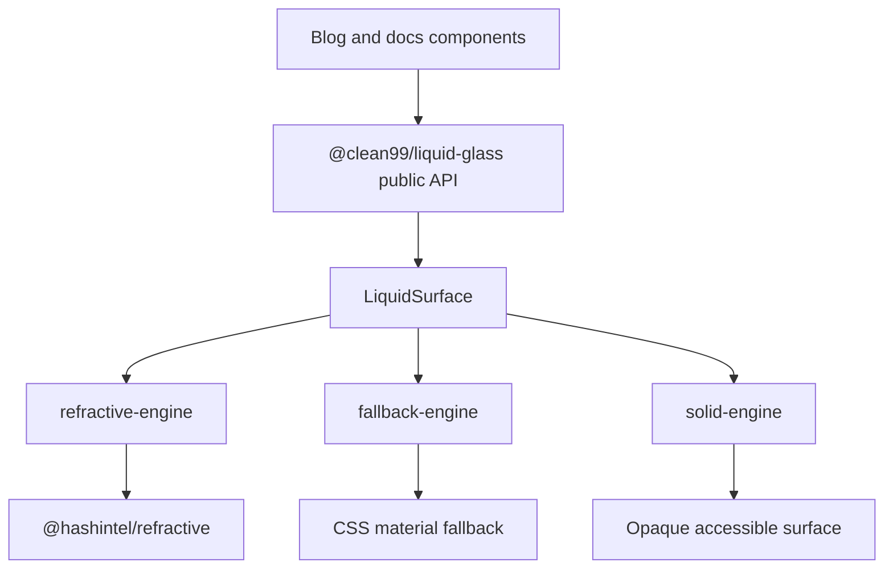
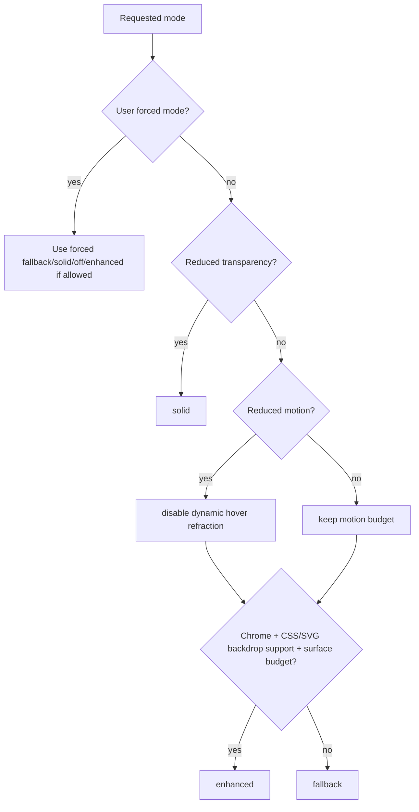

# ADR 0002: Refractive Component Library

Date: 2026-06-11

Status: Accepted

## Context

The visual target is Liquid Glass in the Chris Feijoo / kube.io direction: CSS and SVG refraction, not ordinary glassmorphism. The project must not hand-roll the core refraction engine. The selected engine is `@hashintel/refractive`.

Verified package facts:

- npm package: `@hashintel/refractive`
- current npm version checked during audit: `0.0.4`
- npm description: `HASH Refractive Filter Components`
- license: `MIT OR Apache-2.0`
- repository directory: `libs/@hashintel/refractive` in `hashintel/hash`
- official HASH Design documentation describes it as a library for refractive UI patterns and states that true refraction currently depends on Chrome-only CSS feature support.

Official documentation:

- https://hash.design/libs/refractive
- https://www.npmjs.com/package/@hashintel/refractive

## Decision

Create `packages/liquid-glass` as a publishable React component library on top of `@hashintel/refractive`.

The blog and docs must import Liquid Glass UI only from `@clean99/liquid-glass`. They must not import `@hashintel/refractive` directly.

## Why Use `@hashintel/refractive`

Refraction is the hard part. The official package already focuses on generating SVG filter displacement/specular effects for refractive UI. Rebuilding that in this repository would add risk without creating the right kind of project value. The value of this project is the design-system layer: typed APIs, accessibility, fallback policy, SSR safety, tests, tokens, docs, and a real application.

## Why Not Use `@hashintel/refractive` Directly

Direct usage would leak an early-beta rendering engine into every blog component. That is the wrong ownership boundary.

The wrapper library gives us:

- One public API for `enhanced`, `fallback`, `solid`, `off`, and `auto` modes.
- One place to enforce Chrome-only enhanced behavior.
- One place to cap expensive enhanced surfaces.
- One place to prevent text content from being placed in distorted filter layers.
- Stable component contracts even if the underlying engine API changes.
- A package that can be read, tested, versioned, and potentially published.

## Why Not Hand-Roll Liquid Glass

Hand-rolling the refraction engine would be bad taste here. It would optimize for spectacle while making the data structure worse: every component would need to know about filters, browser quirks, performance limits, and fallback decisions. That spreads special cases everywhere.

The clean structure is:

- `LiquidSurface` is the only component that may directly touch the refraction engine.
- Higher-level components such as `LiquidButton`, `LiquidCard`, `LiquidNav`, and `LiquidToggle` compose `LiquidSurface`.
- Engines are replaceable behind the same mode resolution contract.

## Fallback Is a First-Class Feature

The official documentation states that true refraction currently works only where the required Chrome CSS support exists, and other browsers need graceful fallbacks. That makes fallback a product requirement, not a workaround.

The component library must support:

- `enhanced`: true refraction, conservatively allowed.
- `fallback`: translucent material with blur, saturation, edge highlight, inset highlight, and readable text.
- `solid`: opaque high-contrast surface for reduced transparency and strict readability.
- `off`: no Liquid Glass treatment.
- `auto`: runtime resolution based on capabilities, user preference, accessibility preference, and performance budget.

## Browser Policy

Enhanced refraction is allowed only in Chrome/Chromium enhanced mode for now. Safari, Firefox, and iOS Safari use fallback or solid mode.

Mode resolution must use capability checks, not user agent alone:

This is the smallest non-lying policy: it matches current platform support and avoids pretending Safari/Firefox can run the same visual path.

## Accessibility Policy

The refraction layer is decorative. Content must remain clear:

- Text is rendered in a separate content layer.
- Focus-visible states must be visible in every mode.
- Disabled controls must be non-interactive and visually distinct.
- `prefers-reduced-motion` disables dynamic hover refraction.
- `prefers-reduced-transparency` resolves to solid.
- `prefers-contrast: more` increases border and text contrast.

## Consequences

Positive:

- The component library has a defensible engineering boundary.
- The blog proves the library works in a real site.
- Browser limitations become explicit and testable.
- Future refraction engines can be swapped behind `LiquidSurface`.

Costs:

- We need more tests than a site-only implementation.
- Visual output has two valid paths: enhanced and fallback.
- Package attribution and license files must be maintained.
