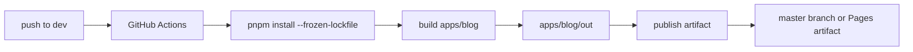
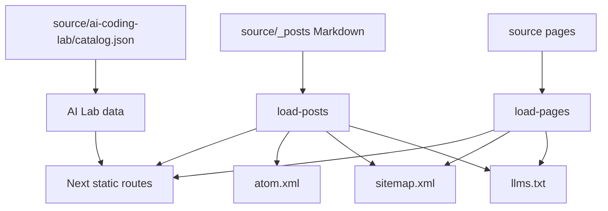

# ADR 0003: Static Export and GitHub Pages

Date: 2026-06-11

Status: Superseded by [ADR 0005](0005-astro-static-rebuild.md)

## Context

The repository currently uses two branches with distinct responsibilities:

- `dev`: source branch.
- `master`: generated GitHub Pages artifact branch.

The source configuration confirms:

- `_config.yml` has `deploy.branch: master`.
- `.github/workflows/deploy.yml` runs on pushes to `dev`.
- The deploy workflow builds Hexo output into `public`.
- The deploy workflow publishes `public` to `master` using `peaceiris/actions-gh-pages`.

This means the actual artifact branch is `master`. The project must not assume `main`.

## Decision

`apps/blog` will use Next.js static export:

- `output: "export"`
- `trailingSlash: true`
- `images.unoptimized: true`
- App Router with static `generateStaticParams`
- no Node server runtime features
- all metadata generated at build time

Deployment will preserve the existing source-to-artifact branch model until GitHub Pages settings are explicitly changed:

Milestone 6 may modernize deployment to GitHub Pages artifact actions, but only after reporting the current `master` artifact branch and keeping a rollback path.

## URL Preservation

Existing public URLs are part of the product. Breaking them is a regression.

The content loader must preserve:

- English post pattern: `/:year/:month/:day/:title/`
- Chinese post pattern: `/zh/:year/:month/:day/:title/`
- Existing explicit `permalink` frontmatter
- `/writing/`
- `/projects/`
- `/ai-coding-lab/`
- `/About/`
- `/about/`
- `/zh/`
- `/atom.xml`
- `/sitemap.xml`
- `/robots.txt`
- `/llms.txt`
- `/404.html`

The `About` casing is a compatibility problem created by history. Static export cannot rely on server redirects, so both `/About/` and `/about/` must generate compatible static output. One should be canonical; the other should be a compatibility page with canonical metadata.

## Feeds and Indexes

Hexo currently delegates RSS and sitemap generation to plugins. Next.js static export must replace this with explicit scripts under `apps/blog/scripts`:

- `load-posts.ts`
- `parse-hexo-content.ts` or `migrate-hexo-posts.ts`
- `generate-rss.ts`
- `generate-sitemap.ts`
- `generate-llms.ts`
- `validate-routes.ts`
- `validate-content.ts`

The output relationship is:

`llms.txt` currently contains `For Interviewers`. The migrated generator must remove that primary entry while keeping the file useful for AI crawlers.

## AI Lab Catalog

The current AI Lab catalog is generated by `tools/ai-coding-lab/build-catalog.mjs`, optionally from a private setup source in CI. The migration must keep an equivalent capability:

- Use committed `source/ai-coding-lab/catalog.json` when the private source is unavailable.
- Regenerate the public catalog when the source is available in CI.
- Preserve the sanitization and leak-prevention tests.
- Do not publish private paths, credentials, or internal platform details.

## GitHub Pages Rollback

Rollback must remain simple:

- Revert the source commit on `dev`.
- Re-run the deploy workflow.
- The `master` artifact branch receives the previous static output.

If deployment later switches to Pages artifact actions, rollback must still be a documented workflow run or branch revert, not a force-push to an unverified artifact branch.

## Consequences

Positive:

- Static export keeps hosting cheap and predictable.
- Build-time route enumeration makes broken URLs testable.
- The actual `master` artifact branch is acknowledged instead of guessed.

Costs:

- We must own feed, sitemap, route, and content validation scripts.
- Static export cannot use runtime redirects, middleware, or server-only data loading.
- Deployment migration must be staged to avoid breaking the live site.
