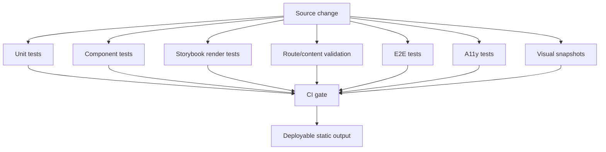

# ADR 0004: Testing and Visual Regression

Date: 2026-06-11

Status: Accepted

## Context

The current project has Node unit tests for post metadata, social-growth tooling, and AI Lab catalog sanitization. The target project is much broader:

- React component library.
- Storybook documentation.
- Next.js static site.
- Browser-mode Liquid Glass enhancement.
- Fallback rendering in non-Chromium browsers.
- Accessibility requirements.
- Visual regression baselines.

Manual inspection is not enough. Liquid Glass can fail in ways that look fine in one browser and unreadable in another.

## Decision

Testing is a release gate for every milestone after the audit. The root monorepo scripts must provide:

- `lint`
- `typecheck`
- `test`
- `test:unit`
- `test:components`
- `test:storybook`
- `test:e2e`
- `test:visual`
- `test:visual:update`
- `test:a11y`
- `test:routes`
- `test:content`
- `test:package`
- `build`
- `ci`

The testing stack will be:

- Vitest for unit logic.
- Testing Library for component behavior.
- Storybook test runner for stories and interaction tests.
- Playwright for route, e2e, accessibility, and visual regression tests.
- `@axe-core/playwright` for critical/serious accessibility gates.

## Test Shape

## Avoiding Flaky UI Tests

Visual tests must be deterministic:

- Use fixed viewport sizes.
- Disable non-essential animation through screenshot CSS.
- Freeze any displayed date/time.
- Use deterministic backgrounds.
- Avoid random gradients, mouse-position effects, timers, and continuously moving surfaces.
- Use stable fonts and commit baselines.
- Update baselines only with `pnpm test:visual:update`.

Enhanced refraction gets Chromium baselines only. Firefox and WebKit test fallback readability, layout stability, and a11y, not pixel-perfect true refraction.

## Component Library Gates

The component library must test:

- support detection
- `resolveLiquidMode`
- reduced motion
- reduced transparency
- localStorage override
- provider defaults
- variant class generation
- SSR safety
- prop forwarding
- ref forwarding
- keyboard operation
- disabled behavior
- focus-visible styles
- fallback mode without enhanced engine classes
- enhanced mode only when allowed

This keeps browser quirks in `support.ts` and engine wrappers, not scattered across visual components.

## Blog Gates

The blog must test:

- all old post URLs are generated
- post count is not reduced
- duplicate slugs and canonical URLs fail the build
- sitemap includes public pages
- RSS contains recent posts
- `llms.txt` is generated
- core pages load
- nav, theme toggle, language switch, and CTA links work
- `/interviewers/` is absent from nav, homepage, and footer primary entries
- no hydration errors
- no console errors
- no critical/serious accessibility violations

## Performance Gates

The Liquid Glass library must not make every surface expensive. The test and review policy is:

- default to limited enhanced surfaces
- reduce or disable enhanced mode on low-power mobile
- do not attach global mousemove handlers for the whole site
- do not instantiate one expensive refraction filter per long-list item
- keep package exports tree-shakable
- run package build checks
- smoke-check the blog build for obvious bundle bloat and console errors

## Open-Source Project Quality

The component library itself is part of the deliverable. It must be readable as an open-source package:

- README with installation, browser support, fallback model, Next.js usage, accessibility, performance, testing, limitations, roadmap, license, and attribution.
- `LICENSE` using MIT for the wrapper package unless later dependency checks require a change.
- `ATTRIBUTIONS.md` crediting `@hashintel/refractive`, HASH, and the Chris Feijoo / kube.io research path without copying third-party source.
- package exports for `.`, `./styles.css`, and `./tokens.css`.
- clean `dist` output with types.

## Consequences

Positive:

- The project demonstrates engineering discipline, not just visual polish.
- Browser support becomes explicit and testable.
- The migration has a real safety net for URLs and content.
- The component library can be reviewed independently from the blog.

Costs:

- Visual baselines are real artifacts and must be maintained.
- CI time increases.
- Some tests will require careful fixture design to avoid flakiness.
