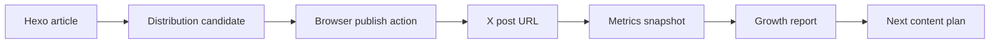

# Social Growth System

This repository now has a small, testable growth pipeline for turning blog posts into X distribution candidates and measuring follower/interaction progress.

## Boundary

The code can automate safe local work:

- read Hexo posts;
- generate UTM links;
- draft X posts and threads;
- create a browser publishing plan;
- calculate follower and interaction progress from snapshots;
- generate reports.

The code must not silently perform public social actions. Posting, replying, liking, reposting, following, or changing account state in Chrome is a public action from the user's account. The browser operator must stop at the action point and get confirmation before the final click.

The system also does not implement mass interaction. That is bad engineering and bad distribution: it creates negative feedback risk and damages account trust.

## Data Model



Core records:

- `Article`: parsed from `source/_posts/*.md`.
- `DistributionCandidate`: one article, one X variant, one UTM URL, one or more post bodies. The post text and `targetUrl` are separate so long UTM links are not truncated by local text guards.
- `MetricsSnapshot`: date, follower count, per-post interactions.
- `GrowthReport`: follower delta, target progress, interaction totals, top posts.

## Commands

List recent posts:

```bash
npm run social:articles -- --limit 5
```

Draft X candidates for one post:

```bash
npm run social:draft -- --slug Automated-AI-Performance-Optimization-with-Harness-and-Goal-Driven-Loops
```

Generate a multi-post plan from recent articles:

```bash
npm run social:plan -- --limit 3
```

Summarize growth progress from a ledger:

```bash
npm run social:report -- --ledger data/social-growth/example-ledger.json
```

Validate code:

```bash
npm run lint
npm test
npm run build
```

## Metrics

Primary metric for the first week:

```text
Follower Delta = latest followers - baseline followers
```

Supporting metrics:

```text
Interaction Total = replies + reposts + quotes + likes + bookmarks
Interaction Rate = Interaction Total / views
Post Score = follows*25 + reposts*8 + quotes*8 + replies*6 + bookmarks*5 + likes
```

The weights are deliberately simple. They are not "the X algorithm". They are a local business scoring rule that values follows and high-intent interactions above likes.

## Manual Snapshot Format

Use `data/social-growth/example-ledger.json` as the shape. Real local data should go into one of the ignored files:

- `data/social-growth/ledger.json`
- `data/social-growth/*.local.json`
- `data/social-growth/snapshots/`

Do not commit private analytics or account history.

## First-Week Loop

1. Generate candidates with `npm run social:plan -- --limit 5`.
2. Select 2-4 strong candidates for the day.
3. Use Chrome to prepare the post.
4. Stop before publishing and confirm the exact text and account.
5. Publish only after confirmation.
6. Record follower count and post interactions twice per day.
7. Run `npm run social:report`.
8. Double down on posts that create follows, replies, reposts, bookmarks, or profile clicks.

## Chrome Integration Plan

The browser layer should be thin. It should accept a `DistributionCandidate`, open X, fill the composer, and stop before the final publish action.

When publishing, append `targetUrl` to the post at `linkPostIndex`. Keep the link out of local truncation logic; X will shorten it through its own URL handling.

Do not put growth logic in the browser layer. The browser layer is only an executor. Article parsing, copy generation, UTM creation, and scoring stay in `tools/social-growth/`.

If Chrome is not logged in to X, stop and ask the user to log in.
