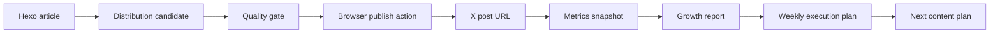

# Social Growth System

This repository now has a small, testable growth pipeline for turning blog posts into Chinese-audience X distribution candidates and measuring follower/interaction progress.

The repeatable workflow is also captured as a project skill:

```text
.agents/skills/x-growth-publishing/SKILL.md
```

Use that skill for future requests about X posting, blog distribution, Chinese X growth, X Article creation, image-backed posts, follower tracking, or content optimization.

## Skill Reuse

- `imagegen`: primary image generation path for X post visuals. It uses the built-in image 2 / `gpt-image-2` capability and does not require `OPENAI_API_KEY`; the final PNG still needs to be copied or registered into `output/imagegen/<queue-id>.png`.
- `baoyu-post-to-x`: useful Chrome/CDP helper for preparing X Articles and regular image posts. It can prefill content in real Chrome while preserving the final manual publish boundary.
- `baoyu-danger-x-to-markdown`: useful only for consented research/archive workflows because it uses a reverse-engineered X API. It is not part of the default publishing or metrics path.

## Boundary

The code can automate safe local work:

- read Hexo posts;
- generate UTM links;
- draft X posts and threads;
- create and persist a browser publishing queue;
- prepare exact handoff text for Chrome;
- export a publish package with image, X Article, short post, thread fallback, and checklist files;
- validate each candidate against the X publishing quality gate before daily packages are exported;
- run a publish preflight that checks image readiness and the public-action confirmation boundary;
- export an image brief with the exact image 2 / `gpt-image-2` prompt, built-in `imagegen` instructions, CLI fallback command, visual review checklist, expected output path, and register command;
- write a single growth status dashboard that combines follower pace, queue coverage, publish preflight, blockers, and next commands;
- run the local daily preparation loop in one command;
- run a safe Codex automation cycle that refreshes local artifacts, status, preflight, image brief, and profile audit without public X actions;
- export and apply a JSON copy override so a separate writing skill can replace generated short-post, X Article, image prompt, fallback thread, and replies before preflight;
- run a full dry-run cycle that simulates publication, metrics capture, ledger update, reporting, and recommendations in ignored local copies;
- generate a 7-day execution plan from the queue, ledger, and quality gate;
- generate a metrics capture template from published queue items;
- run one post-publish metrics cycle that merges published posts, parses copied visible X text, updates the ledger when follower count is present, and writes the next recommendations;
- run one scheduled-safe loop that combines local publish preparation and read-only metrics parsing without browser actions;
- audit the X profile's follower-conversion signals from copied visible profile text;
- produce image 2 / `gpt-image-2` image prompts for each candidate;
- produce an X Article draft before the blog link;
- mark published X URLs back into the queue;
- initialize a one-week follower target ledger;
- append follower and interaction snapshots;
- calculate follower and interaction progress from snapshots;
- generate reports.

The code must not silently perform public social actions. Posting, replying, liking, reposting, following, or changing account state in Chrome is a public action from the user's account. The browser operator must stop at the action point and get confirmation before the final click.

The system also does not implement mass interaction. That is bad engineering and bad distribution: it creates negative feedback risk and damages account trust.

## Data Model



Core records:

- `Article`: parsed from `source/_posts/*.md`.
- `DistributionCandidate`: one article, one X variant, one UTM URL, a Chinese short post, an X Article draft, and an image prompt. The short post does not include the blog URL, and Chinese copy is generated from an article-specific topic frame.
- `QualityGate`: deterministic checks for raw blog URLs, weak first-screen structure, duplicated short posts across articles, X Article link placement, image prompt requirements, and low-value follow-up replies.
- The X Article gate also rejects obvious extraction artifacts, including section-heading fragments glued to body text and Markdown table fragments inside bullets.
- `PublishQueue`: local draft queue of candidates to hand to Chrome.
- `WeeklyExecutionPlan`: seven-day posting and metrics-capture schedule tied to the follower target.
- `PublishPreflight`: the selected package, expected image path, preferred built-in image generation handoff, CLI fallback command, blockers, and browser stop points.
- `MetricsSnapshot`: date, follower count, per-post interactions.
- `GrowthReport`: follower delta, target progress, interaction totals, top posts.

## Commands

List recent posts:

```bash
npm run social:articles -- --limit 5
```

Run the daily safe automation loop:

```bash
npm run social:daily -- --limit 5 --package-limit 3 --lang zh
```

This writes:

- `data/social-growth/queue.json`;
- `data/social-growth/packages/<queue-id>/...`;
- `data/social-growth/posts.local.json`;
- `data/social-growth/daily-run.md`.
- `data/social-growth/weekly-plan.md` when `data/social-growth/ledger.json` exists.

The daily exporter prefers one strong variant per article before exporting extra variants from the same article. This avoids spending a day's slots on three near-duplicate posts.
It exports only items that pass the local quality gate.
When a ledger exists, the daily command expands the article limit as needed to cover the default 7-day, 3-posts/day cadence, capped by available Chinese articles.

Run the full safe automation cycle for Codex or a recurring job:

```bash
npm run social:automation -- --day 1 --slot 1
```

This performs only local work:

- refreshes the Chinese queue, daily report, weekly plan, packages, and metrics template;
- writes `data/social-growth/profile-audit.md` from copied visible profile text;
- writes `data/social-growth/profile-update.md` as a Chrome handoff for display name, bio, link, and pinned post;
- writes `data/social-growth/publish-preflight.md`;
- writes or refreshes the selected `data/social-growth/image-briefs/*.md`;
- writes `data/social-growth/x-publish-prep.md` with `baoyu-post-to-x` Chrome prefill commands;
- writes `data/social-growth/status.md`;
- writes `data/social-growth/automation-run.md`.

It is the preferred recurring entry point. It still does not publish, upload media, reply, like, repost, follow, or edit the X profile. If the output says the image file is missing, generate it with built-in `imagegen` or register an existing PNG first, then rerun preflight before opening Chrome.

Run the scheduled-safe loop:

```bash
npm run social:scheduled-run -- --day 1 --slot 1
```

This combines `social:automation` and `social:metrics-cycle` into one recurring-safe local pass. It refreshes queue/packages/status/preflight/profile/image/X prep artifacts, parses copied visible X text when available, writes reports, and never opens Chrome or performs public X actions.

Run the full local dry-run when content is not ready for real publishing:

```bash
npm run social:flow-dry-run -- --day 1 --slot 1 --out data/social-growth/dry-run/flow-dry-run.md
```

This writes ignored copies under `data/social-growth/dry-run/`: dry queue, dry metrics, dry ledger, preflight copy, X prep copy, report, recommendations, and a summary. It uses placeholder URLs on `x.example.invalid`, does not open Chrome, and does not touch real `queue.json` or `ledger.json`.

Hand content control to a writing skill:

```bash
npm run social:copy-template -- --day 1 --slot 1
```

This writes an ignored JSON template under `data/social-growth/copy-overrides/`. A writing skill should edit these fields only:

- `shortPost`
- `xArticle.title`
- `xArticle.body`
- `image.alt`
- `image.prompt`
- `threadFallback`
- `followUpReplies`

For technical sharing content, use the project skill:

```text
.agents/skills/x-technical-sharing/SKILL.md
```

It adapts the generic `technical-sharing-doc` causality chain into X-native output: short-post first screen, X Article, image prompt, fallback thread, and follow-up replies.

Apply the optimized copy back to the local queue:

```bash
npm run social:apply-copy -- --input data/social-growth/copy-overrides/<queue-id>.json
```

This updates the local queue, writes `data/social-growth/copy-override.md`, and runs the deterministic quality gate, including queue-wide duplicate checks. It still does not open Chrome or perform public X actions. After it passes, run `social:flow-dry-run`, then `social:preflight`, then `social:x-prep`.

Draft X candidates for one post:

```bash
npm run social:draft -- --slug Automated-AI-Performance-Optimization-with-Harness-and-Goal-Driven-Loops
```

Generate a multi-post plan from recent articles:

```bash
npm run social:plan -- --limit 3
```

Write a local publishing queue. Default language is Chinese:

```bash
npm run social:queue -- --limit 3 --lang zh --out data/social-growth/queue.json
```

Prepare the exact text a browser executor should fill:

```bash
npm run social:handoff -- --queue data/social-growth/queue.json --id <queue-id>
```

Export the complete publishing package:

```bash
npm run social:package -- --queue data/social-growth/queue.json --id <queue-id>
```

The package is written under `data/social-growth/packages/<queue-id>/` and contains:

- `image-prompt.txt`;
- `x-article.md`;
- `short-post.txt`;
- `thread-fallback.md`;
- `follow-up-replies.md`;
- `browser-handoff.json`;
- `quality-gate.md`;
- `publish-checklist.md`.

Validate the queue before opening Chrome:

```bash
npm run social:validate -- --queue data/social-growth/queue.json --format markdown
```

The validation must pass before a candidate should be published. The gate rejects the original bad pattern that produced the screenshot: a short post with a raw blog URL and no real reason to click.

Generate the week-level operating plan:

```bash
npm run social:week -- --queue data/social-growth/queue.json --ledger data/social-growth/ledger.json
```

This plan maps validated queue candidates to seven days of publish slots, keeps the pace visible, and warns when the queue does not contain enough validated candidates to sustain the 2-4 posts/day target. The expected healthy state before browser work is `21/21 passed` with `Unfilled slots: 0` for the default cadence.

Check day-level publish readiness:

```bash
npm run social:day-readiness -- --day 1 --out data/social-growth/day-readiness.md
```

This report stays local. It runs preflight and `baoyu-post-to-x` handoff checks for every slot on the selected day, then shows which slots still need images before Chrome work.

Run a publish preflight for the next slot:

```bash
npm run social:preflight -- --day 1 --slot 1 --out data/social-growth/publish-preflight.md
```

The preflight writes the selected queue id, package path, expected image path, built-in `imagegen` handoff, CLI fallback command, and browser stop points. It is allowed to create the local package, but it must not publish, upload, reply, like, repost, follow, or edit.

Write the consolidated local status dashboard:

```bash
npm run social:status -- --day 1 --slot 1 --out data/social-growth/status.md
```

This status file is the first place to look during automation runs. It combines the follower target, queue quality gate, weekly slot coverage, selected publish preflight, image readiness, blockers, and the next commands. It is ignored by git because it reflects local account state and transient publish blockers.

Export the image generation and review handoff for the same slot:

```bash
npm run social:image-brief -- --day 1 --slot 1
```

This writes an ignored Markdown brief under `data/social-growth/image-briefs/`. It contains the short-post first screen, the X Article title, the exact image prompt, the built-in `imagegen` instructions, the CLI fallback command, mobile-readability checks, and the command that registers a generated PNG back into the expected preflight path. Use it when the image is missing or needs visual review before X upload.

If the image was generated by built-in `imagegen` or any other external path, register it into the expected path:

```bash
npm run social:register-image -- --day 1 --slot 1 --source /absolute/path/to/generated.png
```

After registering an image, run preflight again. `OPENAI_API_KEY` is not required for the preferred built-in `imagegen` path; it is only needed when the user explicitly requests the local CLI fallback.

Prepare the Chrome publishing handoff with `baoyu-post-to-x`:

```bash
npm run social:x-prep -- --day 1 --slot 1 --out data/social-growth/x-publish-prep.md
```

This writes commands for preparing the X Article and the follow-up image post in Chrome. It does not publish; final public clicks still require confirmation.

After a confirmed browser publish, write the public X post URL back to the queue:

```bash
npm run social:mark-published -- --queue data/social-growth/queue.json --id <queue-id> --url https://x.com/Clean993/status/<id> --article-url https://x.com/Clean993/articles/<id>
```

Create the metrics template from published queue items:

```bash
npm run social:metrics-template -- --queue data/social-growth/queue.json --out data/social-growth/posts.local.json
```

Parse read-only visible text copied from X into the metrics template:

```bash
npm run social:capture-metrics -- --metrics data/social-growth/posts.local.json --profile-text data/social-growth/profile.local.txt --post-text-dir data/social-growth/post-texts
```

Run the full post-publish metrics cycle:

```bash
npm run social:metrics-cycle -- --metrics data/social-growth/posts.local.json --profile-text data/social-growth/profile.local.txt --post-text-dir data/social-growth/post-texts
```

This command creates or merges the metrics template from published queue items, parses copied visible X profile/post text, writes `data/social-growth/metrics-cycle.md`, writes a growth report, writes recommendations, and appends a ledger snapshot when the follower count is present. It is read-only with respect to X: it does not open Chrome or perform public account actions.

Audit the profile conversion surface from copied visible profile text:

```bash
npm run social:profile-audit -- --profile-text data/social-growth/profile.local.txt --out data/social-growth/profile-audit.md
```

This is local guidance only. It checks whether the visible profile text has a clear technical promise, a blog link, a pinned post, and a readable follower count. Editing the profile, link, or pinned post is a public account change and still requires action-time confirmation in Chrome.

Export the exact profile update handoff:

```bash
npm run social:profile-package -- --profile-text data/social-growth/profile.local.txt --out data/social-growth/profile-update.md
```

This writes the current profile values, proposed display name, bio, link, pinned post draft, Chrome steps, and stop-before points. It is a preparation artifact only; saving the profile, publishing the pinned post, and pinning it still require action-time confirmation.

Initialize a one-week follower ledger:

```bash
npm run social:init-ledger -- --followers 1234 --target 1000 --out data/social-growth/ledger.json
```

Append a snapshot:

```bash
npm run social:snapshot -- --ledger data/social-growth/ledger.json --posts-file data/social-growth/posts.local.json
```

Summarize growth progress from a ledger:

```bash
npm run social:report -- --ledger data/social-growth/example-ledger.json
```

Generate a Markdown report:

```bash
npm run social:report -- --ledger data/social-growth/example-ledger.json --format markdown
```

Generate optimization recommendations:

```bash
npm run social:recommend -- --ledger data/social-growth/ledger.json --format markdown
```

The recommendation notes behind these rules live in:

```text
docs/x-recommendation-notes.md
```

That document maps the public X recommendation architecture into local rules: candidate entry, topic consistency, high-intent interactions, negative-feedback avoidance, author diversity, deduplication, profile clicks, and follower lift.

Validate code:

```bash
npm run lint
npm test
npm run build
```

## Metrics

Primary metric for the first week:

```text
Follower Delta = latest followers - baseline followers
```

Supporting metrics:

```text
Interaction Total = replies + reposts + quotes + likes + bookmarks
Interaction Rate = Interaction Total / views
Post Score = follows*25 + reposts*8 + quotes*8 + replies*6 + bookmarks*5 + likes
```

The weights are deliberately simple. They are not "the X algorithm". They are a local business scoring rule that values follows and high-intent interactions above likes.

## Manual Snapshot Format

Use `data/social-growth/example-ledger.json` as the shape. Real local data should go into one of the ignored files:

- `data/social-growth/ledger.json`
- `data/social-growth/*.local.json`
- `data/social-growth/*.local.txt`
- `data/social-growth/profile-audit.md`
- `data/social-growth/profile-update.md`
- `data/social-growth/queue.json`
- `data/social-growth/post-texts/`
- `data/social-growth/snapshots/`
- `data/social-growth/day-readiness.md`
- `data/social-growth/slot-readiness/`

Do not commit private analytics or account history.

`posts.local.json` can be a plain array, but the preferred format is a snapshot object:

```json
{
  "version": 1,
  "date": "2026-05-19",
  "followers": "1300",
  "posts": [
    {
      "id": "Automated-AI-Performance-Optimization-with-Harness-and-Goal-Driven-Loops__zh__strong-thesis__00",
      "articleSlug": "Automated-AI-Performance-Optimization-with-Harness-and-Goal-Driven-Loops",
      "variant": "strong-thesis",
      "url": "https://x.com/Clean993/status/0000000000000000000",
      "xArticleUrl": "https://x.com/Clean993/articles/0000000000000000000",
      "metrics": {
        "views": "1.5K",
        "likes": "40",
        "replies": "2",
        "reposts": "3",
        "quotes": "1",
        "bookmarks": "5",
        "profileClicks": "8",
        "follows": "4"
      }
    }
  ]
}
```

## First-Week Loop

1. Generate a queue with `npm run social:queue -- --limit 5 --out data/social-growth/queue.json`.
2. Run `npm run social:validate -- --queue data/social-growth/queue.json --format markdown`.
3. Run `npm run social:week -- --queue data/social-growth/queue.json --ledger data/social-growth/ledger.json`.
4. Pick 2-4 strong queue items for the day from `data/social-growth/weekly-plan.md`.
5. Run `npm run social:preflight -- --day 1 --slot 1 --out data/social-growth/publish-preflight.md`.
6. Run `npm run social:handoff -- --queue data/social-growth/queue.json --id <queue-id>`.
7. Run `npm run social:package -- --queue data/social-growth/queue.json --id <queue-id>`.
8. Generate the image from `image-prompt.txt` with built-in `imagegen`, then register the final selected PNG into the expected path.
9. If the image was generated elsewhere, run `npm run social:register-image -- --day 1 --slot 1 --source /absolute/path/to/generated.png`.
10. Re-run preflight and require `Status: ready`.
11. Run `npm run social:x-prep -- --day 1 --slot 1 --out data/social-growth/x-publish-prep.md`.
12. Use Chrome to prepare the X Article first. If X Article is unavailable for the account, fall back to a thread.
13. Stop before publishing the X Article or thread and confirm the exact content and account.
14. Publish only after confirmation.
15. Use Chrome to prepare the short image-backed X post linking to the X Article.
16. Stop before publishing the short post and confirm the exact content and account.
17. Prepare 1-2 substantive follow-up replies from `follow-up-replies.md`.
18. Stop before each public reply and confirm the exact content and account.
19. If `profile-update.md` is still needed, prepare the profile edit and pinned-post flow in Chrome, stopping before every save/publish/pin action.
19. Mark the published URL with `npm run social:mark-published`.
20. Run `npm run social:metrics-template`.
21. Use `npm run social:capture-metrics` when visible X text has been captured.
22. Or run `npm run social:metrics-cycle` to merge capture, snapshot, report, and recommendations in one read-only local pass.
23. Fill any missing follower count and post interactions twice per day in `data/social-growth/posts.local.json`.
24. Run `npm run social:snapshot` if you did not use `social:metrics-cycle`.
25. Run `npm run social:report -- --format markdown`.
26. Run `npm run social:recommend -- --format markdown`.
27. Double down on posts that create follows, replies, reposts, bookmarks, or profile clicks.

For regular operation, replace steps 1-6 with:

```bash
npm run social:automation -- --day 1 --slot 1
```

Then continue from image generation and browser confirmation.

## Chrome Integration Plan

The browser layer should be thin. It should accept a `DistributionCandidate`, open X, fill the Article editor or composer, and stop before the final publish action.

For the Chinese growth workflow, do not append `targetUrl` to the short post. Put the blog URL only at the end of `xArticle.body`, then link the short post to the published X Article URL.

Follow-up replies are allowed only when they add technical detail to the user's own post. Do not use them as engagement bait, and stop before every public reply action.

Do not put growth logic in the browser layer. The browser layer is only an executor. Article parsing, copy generation, UTM creation, and scoring stay in `tools/social-growth/`.

If Chrome is not logged in to X, stop and ask the user to log in.
