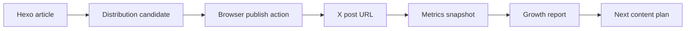

# Social Growth System

This repository now has a small, testable growth pipeline for turning blog posts into Chinese-audience X distribution candidates and measuring follower/interaction progress.

The repeatable workflow is also captured as a project skill:

```text
.agents/skills/x-growth-publishing/SKILL.md
```

Use that skill for future requests about X posting, blog distribution, Chinese X growth, X Article creation, image-backed posts, follower tracking, or content optimization.

## Boundary

The code can automate safe local work:

- read Hexo posts;
- generate UTM links;
- draft X posts and threads;
- create and persist a browser publishing queue;
- prepare exact handoff text for Chrome;
- export a publish package with image, X Article, short post, thread fallback, and checklist files;
- run the local daily preparation loop in one command;
- generate a metrics capture template from published queue items;
- produce `gpt-image-2` image prompts for each candidate;
- produce an X Article draft before the blog link;
- mark published X URLs back into the queue;
- initialize a one-week follower target ledger;
- append follower and interaction snapshots;
- calculate follower and interaction progress from snapshots;
- generate reports.

The code must not silently perform public social actions. Posting, replying, liking, reposting, following, or changing account state in Chrome is a public action from the user's account. The browser operator must stop at the action point and get confirmation before the final click.

The system also does not implement mass interaction. That is bad engineering and bad distribution: it creates negative feedback risk and damages account trust.

## Data Model



Core records:

- `Article`: parsed from `source/_posts/*.md`.
- `DistributionCandidate`: one article, one X variant, one UTM URL, a Chinese short post, an X Article draft, and an image prompt. The short post does not include the blog URL.
- `PublishQueue`: local draft queue of candidates to hand to Chrome.
- `MetricsSnapshot`: date, follower count, per-post interactions.
- `GrowthReport`: follower delta, target progress, interaction totals, top posts.

## Commands

List recent posts:

```bash
npm run social:articles -- --limit 5
```

Run the daily safe automation loop:

```bash
npm run social:daily -- --limit 5 --package-limit 3 --lang zh
```

This writes:

- `data/social-growth/queue.json`;
- `data/social-growth/packages/<queue-id>/...`;
- `data/social-growth/posts.local.json`;
- `data/social-growth/daily-run.md`.

Draft X candidates for one post:

```bash
npm run social:draft -- --slug Automated-AI-Performance-Optimization-with-Harness-and-Goal-Driven-Loops
```

Generate a multi-post plan from recent articles:

```bash
npm run social:plan -- --limit 3
```

Write a local publishing queue. Default language is Chinese:

```bash
npm run social:queue -- --limit 3 --lang zh --out data/social-growth/queue.json
```

Prepare the exact text a browser executor should fill:

```bash
npm run social:handoff -- --queue data/social-growth/queue.json --id <queue-id>
```

Export the complete publishing package:

```bash
npm run social:package -- --queue data/social-growth/queue.json --id <queue-id>
```

The package is written under `data/social-growth/packages/<queue-id>/` and contains:

- `image-prompt.txt`;
- `x-article.md`;
- `short-post.txt`;
- `thread-fallback.md`;
- `browser-handoff.json`;
- `publish-checklist.md`.

After a confirmed browser publish, write the public X post URL back to the queue:

```bash
npm run social:mark-published -- --queue data/social-growth/queue.json --id <queue-id> --url https://x.com/Clean993/status/<id> --article-url https://x.com/Clean993/articles/<id>
```

Create the metrics template from published queue items:

```bash
npm run social:metrics-template -- --queue data/social-growth/queue.json --out data/social-growth/posts.local.json
```

Initialize a one-week follower ledger:

```bash
npm run social:init-ledger -- --followers 1234 --target 1000 --out data/social-growth/ledger.json
```

Append a snapshot:

```bash
npm run social:snapshot -- --ledger data/social-growth/ledger.json --posts-file data/social-growth/posts.local.json
```

Summarize growth progress from a ledger:

```bash
npm run social:report -- --ledger data/social-growth/example-ledger.json
```

Generate a Markdown report:

```bash
npm run social:report -- --ledger data/social-growth/example-ledger.json --format markdown
```

Validate code:

```bash
npm run lint
npm test
npm run build
```

## Metrics

Primary metric for the first week:

```text
Follower Delta = latest followers - baseline followers
```

Supporting metrics:

```text
Interaction Total = replies + reposts + quotes + likes + bookmarks
Interaction Rate = Interaction Total / views
Post Score = follows*25 + reposts*8 + quotes*8 + replies*6 + bookmarks*5 + likes
```

The weights are deliberately simple. They are not "the X algorithm". They are a local business scoring rule that values follows and high-intent interactions above likes.

## Manual Snapshot Format

Use `data/social-growth/example-ledger.json` as the shape. Real local data should go into one of the ignored files:

- `data/social-growth/ledger.json`
- `data/social-growth/*.local.json`
- `data/social-growth/queue.json`
- `data/social-growth/snapshots/`

Do not commit private analytics or account history.

`posts.local.json` can be a plain array, but the preferred format is a snapshot object:

```json
{
  "version": 1,
  "date": "2026-05-19",
  "followers": "1300",
  "posts": [
    {
      "id": "Automated-AI-Performance-Optimization-with-Harness-and-Goal-Driven-Loops__zh__strong-thesis__00",
      "articleSlug": "Automated-AI-Performance-Optimization-with-Harness-and-Goal-Driven-Loops",
      "variant": "strong-thesis",
      "url": "https://x.com/Clean993/status/0000000000000000000",
      "xArticleUrl": "https://x.com/Clean993/articles/0000000000000000000",
      "metrics": {
        "views": "1.5K",
        "likes": "40",
        "replies": "2",
        "reposts": "3",
        "quotes": "1",
        "bookmarks": "5",
        "profileClicks": "8",
        "follows": "4"
      }
    }
  ]
}
```

## First-Week Loop

1. Generate a queue with `npm run social:queue -- --limit 5 --out data/social-growth/queue.json`.
2. Pick 2-4 strong queue items for the day.
3. Run `npm run social:handoff -- --queue data/social-growth/queue.json --id <queue-id>`.
4. Run `npm run social:package -- --queue data/social-growth/queue.json --id <queue-id>`.
5. Generate the image from `image-prompt.txt` with `gpt-image-2`.
6. Use Chrome to prepare the X Article first. If X Article is unavailable for the account, fall back to a thread.
7. Stop before publishing the X Article or thread and confirm the exact content and account.
8. Publish only after confirmation.
9. Use Chrome to prepare the short image-backed X post linking to the X Article.
10. Stop before publishing the short post and confirm the exact content and account.
11. Mark the published URL with `npm run social:mark-published`.
12. Run `npm run social:metrics-template`.
13. Fill follower count and post interactions twice per day in `data/social-growth/posts.local.json`.
14. Run `npm run social:snapshot`.
15. Run `npm run social:report -- --format markdown`.
16. Double down on posts that create follows, replies, reposts, bookmarks, or profile clicks.

For regular operation, replace steps 1-4 with:

```bash
npm run social:daily -- --limit 5 --package-limit 3 --lang zh
```

Then continue from image generation and browser confirmation.

## Chrome Integration Plan

The browser layer should be thin. It should accept a `DistributionCandidate`, open X, fill the Article editor or composer, and stop before the final publish action.

For the Chinese growth workflow, do not append `targetUrl` to the short post. Put the blog URL only at the end of `xArticle.body`, then link the short post to the published X Article URL.

Do not put growth logic in the browser layer. The browser layer is only an executor. Article parsing, copy generation, UTM creation, and scoring stay in `tools/social-growth/`.

If Chrome is not logged in to X, stop and ask the user to log in.
