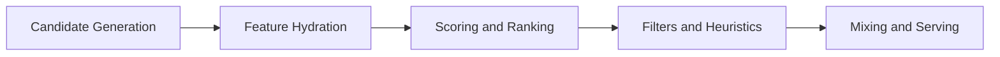

# X Recommendation Notes for Blog Growth

Date: 2026-05-18

This note summarizes public material about X's recommendation systems and turns it into content rules for this blog. It is not a promise that any single trick will grow the account. The useful part is the data model: candidate sourcing, ranking, filtering, and negative feedback.

## Sources

- X engineering, "Twitter's Recommendation Algorithm", 2023-03-31: https://blog.x.com/engineering/en_us/topics/open-source/2023/twitter-recommendation-algorithm
- `twitter/the-algorithm`: https://github.com/twitter/the-algorithm
- `twitter/the-algorithm/home-mixer`: https://github.com/twitter/the-algorithm/blob/main/home-mixer/README.md
- `xai-org/x-algorithm`: https://github.com/xai-org/x-algorithm
- Ajit Singh, "X Algorithm Explained", 2026-01-22, updated 2026-04-08: https://singhajit.com/system-design/x-twitter-for-you-algorithm/

Prefer the GitHub repositories and X engineering post when there is a conflict. Third-party explainers are useful for interpretation, not authority.

## What the Open Material Says

The 2023 X engineering post describes a three-stage For You pipeline:

1. Candidate sourcing: collect posts from in-network and out-of-network sources.
2. Ranking: score candidates with ML models that predict engagement probabilities.
3. Heuristics and filters: remove blocked, muted, NSFW, duplicate, already-seen, or over-repeated content.

The 2023 post says the system tries to extract about 1,500 candidates from hundreds of millions of posts, with an average balance of roughly 50% in-network and 50% out-of-network. It also names important concepts: Real Graph, GraphJet, SimClusters, author diversity, content balance, feedback fatigue, social proof, and conversation context.

The `twitter/the-algorithm` repository README maps the larger architecture:

- `tweetypie`: post read/write data.
- `unified-user-actions`: real-time user action stream.
- `user-signal-service`: explicit and implicit signals, such as likes, replies, profile visits, and post clicks.
- `SimClusters` and `TwHIN`: user/post embeddings.
- `real-graph`: likelihood that one user will interact with another.
- `tweepcred`: reputation-like PageRank.
- `home-mixer` and `product-mixer`: feed assembly frameworks.

The `home-mixer` README makes the feed shape explicit:

It also lists concrete filters and product constraints: author diversity, content balance, feedback fatigue, deduplication, previously seen removal, and visibility filtering.

The newer `xai-org/x-algorithm` README, as of 2026-05-18, says the current For You feed combines:

- in-network posts from Thunder;
- out-of-network posts from Phoenix retrieval;
- ranking through a Grok-based transformer model;
- multi-action prediction, including probabilities for likes, replies, reposts, clicks, profile clicks, follows, dwell, and negative actions;
- author diversity and final visibility filters.

It also states that the 2026-05-15 update added a runnable retrieval-to-ranking pipeline, model artifacts, Grox content-understanding components, ads blending, richer query/candidate hydrators, and additional candidate sources.

## Practical Content Rules

## Algorithm-to-System Rules

The local system should behave like a small experimental recommender-facing publishing loop, not like a bulk poster.

| Open recommendation concept | Source signal | Local system rule |
| --- | --- | --- |
| Candidate sourcing | Home Mixer candidate generation, Thunder in-network, Phoenix out-of-network retrieval | Keep a narrow technical topic graph so new posts can enter the right in-network and out-of-network pools. |
| Feature/query hydration | user action history, followed topics, impression history, author/post metadata | Use consistent tags, repeated topic vocabulary, image alt/prompt language, and profile promise. |
| Multi-action prediction | favorite, reply, repost, quote, click, profile click, dwell, follow author, and negative actions | Score local results by follows, profile clicks, bookmarks, reposts, quotes, replies, and views; do not optimize for likes alone. |
| Negative actions | not interested, block, mute, report, visibility filters | Ban mass replies, duplicated templates, off-topic trend hijacking, and engagement bait. |
| Author diversity | repeated author attenuation and feed diversity constraints | Use 2-4 high-quality posts/day, spaced slots, and avoid burst posting. |
| Previously seen/dedup filters | seen/served and duplicate filtering | Do not repost near-identical short posts; force article-diverse daily packages. |
| Social proof | second-degree engagement and conversation context | Prefer substantive replies to relevant technical threads only when they add mechanism, proof, or a concrete correction. |

This is why the implementation has a quality gate before browser work. The gate is not copy taste theater; it prevents actions that would create ranking debt.

### 1. Win Candidate Entry Before Optimizing Ranking

A post cannot rank if it never enters candidate pools. For this blog, candidate entry comes from:

- in-network followers who already care about frontend, testing, software engineering, AI, and performance;
- second-degree social proof when people in that niche like, reply, repost, or bookmark;
- topical embedding match through repeated technical vocabulary and consistent author positioning.

Action:

- keep account positioning narrow for the first growth loop;
- publish around a small number of repeated themes;
- avoid one-off viral topics that do not teach the model who should see the account.

### 2. Optimize for High-Intent Interactions

The model family predicts multiple actions, not one generic "engagement". Likes are cheap. Replies, reposts, bookmarks, profile clicks, and follows are stronger business signals for this goal.

Action:

- write posts that invite a technical reply without begging for engagement;
- make one concrete claim per post;
- include a reusable frame, checklist, or diagnostic heuristic worth bookmarking;
- attach an image that explains the mechanism faster than text;
- put the full reasoning into an X Article before sending the reader to the blog;
- use replies to add depth to your own post, not filler.

### 3. Avoid Negative Feedback

Negative actions such as "not interested", mute, block, and report are explicitly part of modern ranking descriptions. Aggressive automation, repetitive templates, engagement bait, and irrelevant replies are not just ugly; they are likely ranking debt.

Action:

- no mass replies;
- no follow/unfollow loops;
- no generic "great post" replies;
- no duplicate posts with tiny wording changes;
- no posting into unrelated viral threads.

### 4. Use Author Diversity Instead of Fighting It

The feed applies author diversity. Posting twenty times in a burst is a bad plan: even if the first post works, repeated author attenuation can make the rest invisible or irritating.

Action:

- publish 2-4 high-quality posts per day during the first week;
- use threads only when each reply adds substance;
- separate reposts by enough time to avoid self-competition.

### 5. Write for Dwell and Profile Clicks

The current open materials mention dwell, clicks, profile clicks, and follow-author prediction. A useful post should make the reader pause, then make the profile promise obvious.

Action:

- first line: sharp technical claim;
- body: compressed reasoning or evidence;
- last line or linked article: clear next step;
- profile bio should match the repeated content themes.

## One-Week Experiment Shape

Goal: +1000 followers in seven days.

This target is aggressive. Treat it as a measurement goal, not a guaranteed result.

Daily operating loop:

1. Publish 2-4 original posts from blog material.
2. Add 1-2 substantial replies to your own post when the reply expands the idea.
3. Run `npm run social:engagement-search`, capture 5-10 relevant accounts or threads into `data/social-growth/engagement-opportunities/`, run `npm run social:engagement`, and only reply when the generated candidate adds a real technical contribution.
4. Record followers and interactions twice per day.
5. Promote winning themes, kill weak templates fast.

Safe automation loop:

1. Run `npm run social:automation -- --day 1 --slot 1`.
2. Read `data/social-growth/automation-run.md` and `data/social-growth/status.md`.
3. If image generation is blocked, generate/register the `gpt-image-2` PNG from the image brief.
4. Only then open Chrome for the X Article/image-backed post, stopping before public actions.
5. After confirmed publishing, mark URLs and snapshot metrics.

The system should optimize toward:

- follower delta;
- replies from relevant technical accounts;
- reposts and quotes;
- bookmarks when visible;
- profile clicks if visible;
- interaction rate per view.

It should not optimize toward:

- raw number of actions performed;
- likes without follower lift;
- generic replies;
- short-term reach bought with off-topic controversy.
