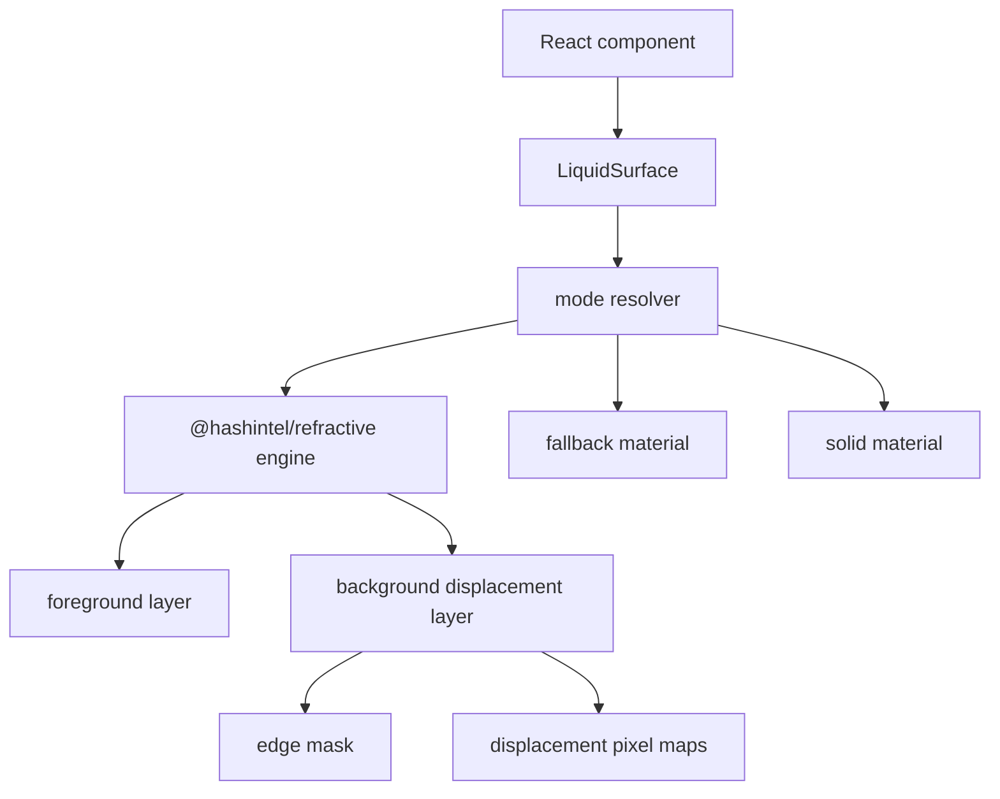
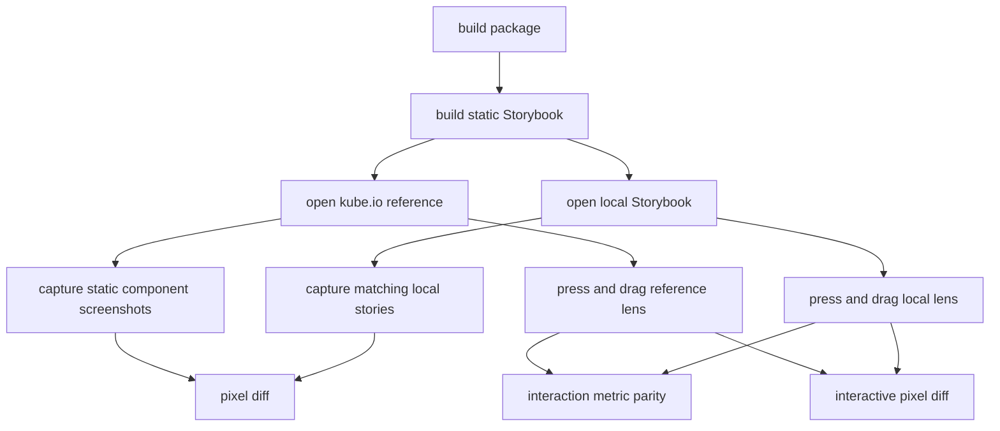

Liquid Glass 最容易做坏的地方，是把半透明矩形、blur 和阴影误认为玻璃。

我这次把个人博客的改版先停住，先做组件库。原因很简单：如果一个效果只能在首页里靠调几个 class 活着，它不是设计系统。它只是一次皮肤。

目标更苛刻一点：组件库要能复刻 [Kube Liquid Glass CSS/SVG 文章](https://kube.io/blog/liquid-glass-css-svg/)里的交互组件，并用截图像素差异和真实 pointer 行为证明自己在接近。肉眼觉得“差不多”不算证据。

## 第一个 bug：玻璃不应该长出交叉纹理

早期版本的 demo 看起来很糟糕。圆角胶囊里有两条不自然的交叉线，focus 状态像蓝色塑料框，搜索框和 tabs 都有廉价的边。

这不是审美问题，是物理模型错了。

玻璃折射会弯曲背后的图案。它不会凭空生成一组和背景无关的交叉纹理。出现这种线，通常说明 filter map 或 background fixture 在用错误方式叠加：同一个边缘场被拿去做了不该做的两层位移，或者整个中心区域也被当成边缘继续推。

所以我把问题拆回数据结构，先停掉继续调 CSS 的冲动：



`LiquidSurface` 是唯一能碰折射引擎的组件。Button、Tabs、SearchBox、Switch 和 Nav 都只能组合它。这个边界很重要，后面所有测试也围着它写：文字层永远清晰，位移只作用在背景层。

## 为什么不用自己手搓全部折射

这个项目使用 `@hashintel/refractive` 做真实 refraction engine。自己从零写一个“看起来像玻璃”的 filter 不难，难的是把行为、性能、fallback、可访问性、SSR 和测试都变成稳定契约。

我不想把组件库变成一堆不可解释的 SVG 魔法。真正需要自己负责的是这些层：

| 层 | 组件库负责什么 |
| --- | --- |
| API | React 组件、forwardRef、语义元素、可组合性 |
| mode | enhanced、fallback、solid、off 的解析 |
| material | focus、active、hover、dark mode、高对比度和 reduced transparency |
| physics | edge mask、clean center、bounded elasticity、specular rim |
| gates | unit、Storybook、a11y、E2E、visual、Kube reference |

`@hashintel/refractive` 解决的是底层折射能力。组件库解决的是产品级使用问题。

## 两张 map 不能混成一张

Kube 的 magnifying glass demo 不是一个简单的 capsule blur。它至少有两层不同的光学动作：

1. 第一层把源图像向中心拉，形成放大效果。
2. 第二层在胶囊边缘做 bevel displacement。

早期我把这两层都当成同一个 capsule edge field，结果就是用户指出的交叉纹理。物理上说不通，视觉上也很脏。

现在的实现把它们拆开：

| map | 用途 | 约束 |
| --- | --- | --- |
| `magnification map` | 做中心拉伸和放大 | 中心必须回到 neutral，角落向中心拉 |
| `displacement map` | 做胶囊边缘折射 | 只在 bevel 附近有效，不能把中心持续推歪 |
| `specular map` | 做边缘高光 | 细、灰、透明中心，不能画成白色塑料圈 |

这里有个很具体的数：Kube 目标里 capsule radius 约是 `75px`，但 bevel displacement 的有效回落宽度更接近 `25px`。把半径直接当 falloff，会把位移推进中心，线条就开始互相打架。

## Focus 应该改变材料状态

我一开始犯的另一个错，是把 focus-visible 做成了蓝边。它能过基础可访问性，但不像 Liquid Glass。

参考 Kube 页面和 Apple 风格后，focus 应该更像材料状态变化：

- 玻璃体轻微放大；
- 磨砂层更深；
- 边缘高光更明显；
- 阴影和 scale 有动画；
- 文字和 icon 仍然在清晰前景层；
- 没有硬白边、硬黑边或塑料蓝圈。

这件事也进了测试。`tests/refraction-physics.test.ts` 会把 hard focus ring 当回归；只检查有没有 focus 样式不够。

## 真实拖拽必须进测试

只测 DOM class 没意义。Kube 的 demo 点击玻璃后会变成水滴状，拖动时宽高变化也不同。用理论推断“应该已经对了”，就是自欺欺人。

所以现在的 Kube gate 会做真实浏览器动作：



当前本地数据是这样：

| Reference | Diff ratio | Threshold | Mode |
| --- | ---: | ---: | --- |
| magnifying-glass | `0.2000` | `0.3000` | gate |
| magnifying-glass-pressed | `0.4580` | `0.4200` | report |
| magnifying-glass-dragged | `0.4939` | `0.4500` | report |
| searchbox | `0.0167` | `0.0300` | gate |
| switch | `0.0142` | `0.0300` | gate |
| slider | `0.0149` | `0.0300` | gate |

这组数字的意义很明确：searchbox、switch、slider 已经进入当前截图预算。magnifying glass 的静态态过了一个宽松 gate，但交互态还不能吹。

`pnpm test:kube-reference` 会跑普通 gate。`pnpm test:kube-reference:strict` 会把 pressed 和 dragged 的截图也变成硬门禁。现在 strict 还不该通过，因为材料和水滴形变还没收敛到目标。

## 为什么 fallback 是一等公民

真实 refraction 只在 Chrome/Chromium enhanced mode 下启用。Safari、Firefox、iOS Safari、reduced transparency、高对比度、低功耗移动端都走 fallback 或 solid。

这不是保守，是工程边界。

Liquid Glass 是昂贵效果。把每个 card 都挂上 refraction，用户得到的是卡顿。更糟糕的是，浏览器差异会让同一个 filter 在不同环境下表现不同。组件库默认不把风险推给业务。

模式解析规则大概是：

| 条件 | 默认行为 |
| --- | --- |
| Chrome/Chromium desktop 且能力检查通过 | enhanced 可用 |
| mobile | fallback 优先，限制 enhanced surface 数量 |
| Safari / Firefox / iOS Safari | fallback 或 solid |
| prefers-reduced-transparency | solid |
| prefers-reduced-motion | 禁用动态 hover refraction |
| prefers-contrast: more | 提高 fill、border、text contrast |

所以 fallback 是稳定产品路径，不是“效果坏了的备胎”。

## 组件库要按开源项目验收

目前组件库按 shadcn/ui 的组件索引做 parity。官方组件列表实时抓取后是 `59` 个，库里实现了 `60` 个组件入口，额外包括 Liquid Glass 自己的 surface/lens 方向。

验证脚本要证明这些承诺：

| 检查 | 当前结果 |
| --- | --- |
| component inventory | `60` implemented components |
| shadcn parity | `59` official entries validated |
| registry | `60` generated registry items |
| docs contract | `40` open-source files validated |
| unit tests | `145` tests passing |
| package output | ESM、CJS、types、styles、tokens validated |

它还包括 GitHub Actions、issue templates、PR template、CODEOWNERS、Changesets、Storybook Pages、visual regression、a11y gate 和 release workflow。仓库还没推上 GitHub，因为远端 `clean99/liquid-glass` 需要先创建，但本地仓库已经按独立开源包组织。

这个状态还不等于完成。完成的标准是：博客真的用这个库，组件在真实页面里工作，Kube strict gate 收敛，文章里的判断经得起后续测试回放。

## 走过的弯路

几个错误要记下来：

1. 用纹理解释玻璃，错。纹理应该来自背景被折射，不应该是组件自己长出来。
2. 用一张 map 做两层位移，错。放大和 bevel 是两件事。
3. focus 画硬边，错。Liquid Glass 的 focus 是材料变深和尺度变化。
4. 用 class 测试交互，错。必须用真实 pointer press、drag 和截图。
5. 在每个组件上默认 enhanced，错。surface budget 是 API 设计的一部分。

最烦的一点是，这些错误看起来都能解释成“设计还没调好”。但其实它们是模型错了。模型错了，CSS 调得越多越脏。

## 下一步

我会继续把 strict gate 往下压：

1. 把 magnifying glass 静态 diff 从 `0.20` 压到更接近 `0.10`。
2. 让 pressed 和 dragged 从 report-only 进入 hard gate。
3. 把博客首页、文章页和 docs 都迁到组件库，禁止在博客里重写一套 glass UI。
4. 把这篇文章继续更新成完整的工程复盘，包括失败截图、map 采样和测试脚本细节。

如果只能保留一个原则，我会保留这个：

```text
No physical model, no Liquid Glass claim.
No browser pixel gate, no parity claim.
```

玻璃效果依赖几何、材质、交互和测试。少一个，最后都会变成塑料。
